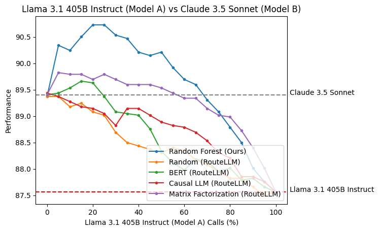

# RoRF - Routing on Random Forests

RoRF is a framework for training and serving random forest-based LLM routers. Our experiments show that:
- Routing between a pair of strong and weak models can reduce costs while maintaining the strong model's performance.
- Routing between a pair of two strong models can reduce costs while outperforming both individual models.

Our core features include:
- 12 pre-trained routers across 6 model pairs and 2 embedding models ([jinaai/jina-embeddings-v3](https://huggingface.co/jinaai/jina-embeddings-v3), [voyageai/voyage-large-2-instruct](https://docs.voyageai.com/docs/embeddings#model-choices)) that reduce costs while maintaining or improving performance.
- Our pre-trained routers outperform existing routing solutions, including open-source and commercial offerings.



## Installation
### PyPI
```sh
pip install rorf
```
### Source
```sh
git clone https://github.com/Not-Diamond/RoRF
cd RoRF
pip install -e .
```

## Quickstart
We adopt RouteLLM's [Controller](https://github.com/lm-sys/RouteLLM/tree/main?tab=readme-ov-file#quickstart) to allow users to replace their existing routing setups with RoRF. Our `Controller` requires a `router` (available either locally or on Huggingface Hub) that routes between `model_a` (usually stronger) and `model_b` (usually weaker). Our release includes 6 model pairs between different models and providers.
```python
from rorf.controller import Controller

router = Controller(
    router="notdiamond/rorf-jina-llama31405b-llama3170b",
    model_a="llama-3.1-405b-instruct",
    model_b="llama-3.1-70b-instruct",
    threshold=0.3,
)

recommended_model = router.route("What is the meaning of life?")
print(f"Recommended model: {recommended_model}")
```
We also provide a `threshold` parameter that determines the percentage of calls made to each model, allowing users to decide their own cost vs performance tradeoffs.

### Threshold calibration
The `threshold` parameter controls the percentage of calls made to each model but depending on the types of query you might receive, you should calibrate it with your own data. As an example, we can use the dataset [`notdiamond/rorf-llama31405b-llama3170b-battles`](https://huggingface.co/datasets/notdiamond/rorf-llama31405b-llama3170b-battles) to calibrate the threshold for sending 50% of the calls to `llama-3.1-405b-instruct`.

``` shell
python -m rorf.calibrate_threshold --calibration-dataset "notdiamond/rorf-llama31405b-llama3170b-battles" --router "notdiamond/rorf-jina-llama31405b-llama3170b" --model-a-pct 0.5 --task generate
```

## Pre-trained routers
We provide 12 pre-trained routers using 2 different embedding models. 6 routers are based on the open-source [jinaai/jina-embeddings-v3](https://huggingface.co/jinaai/jina-embeddings-v3) embedding model, giving developers a completely free experience. Another 6 are based on the closed source [voyageai/voyage-large-2-instruct](https://docs.voyageai.com/docs/embeddings#model-choices) embedding model, allowing developers to use the routers easily with less compute.

The notation `rorf-<embed>-<model_a>-<model_b>` indicates the embedding model `<embed>` used and the two models `<model_a>` and `<model_b>` that it routes between.

### jina-embeddings-v3
- [notdiamond/rorf-jina-llama31405b-llama3170b](https://huggingface.co/notdiamond/rorf-jina-llama31405b-llama3170b)
- [notdiamond/rorf-jina-llama31405b-claude35sonnet](https://huggingface.co/notdiamond/rorf-jina-llama31405b-claude35sonnet)
- [notdiamond/rorf-jina-llama31405b-gpt4o](https://huggingface.co/notdiamond/rorf-jina-llama31405b-gpt4o)
- [notdiamond/rorf-jina-llama31405b-mistrallarge](https://huggingface.co/notdiamond/rorf-jina-llama31405b-mistrallarge)
- [notdiamond/rorf-jina-gpt4o-gpt4omini](https://huggingface.co/notdiamond/rorf-jina-gpt4o-gpt4omini)
- [notdiamond/rorf-jina-claude35sonnet-gpt4o](https://huggingface.co/notdiamond/rorf-jina-claude35sonnet-gpt4o)

### voyage-large-2-instruct
To use these routers, set the environment variable `VOYAGE_API_KEY=...`.

- [notdiamond/rorf-voyage-llama31405b-llama3170b](https://huggingface.co/notdiamond/rorf-voyage-llama31405b-llama3170b)
- [notdiamond/rorf-voyage-llama31405b-claude35sonnet](https://huggingface.co/notdiamond/rorf-voyage-llama31405b-claude35sonnet)
- [notdiamond/rorf-voyage-llama31405b-gpt4o](https://huggingface.co/notdiamond/rorf-voyage-llama31405b-gpt4o)
- [notdiamond/rorf-voyage-llama31405b-mistrallarge](https://huggingface.co/notdiamond/rorf-voyage-llama31405b-mistrallarge)
- [notdiamond/rorf-voyage-gpt4o-gpt4omini](https://huggingface.co/notdiamond/rorf-voyage-gpt4o-gpt4omini)
- [notdiamond/rorf-voyage-claude35sonnet-gpt4o](https://huggingface.co/notdiamond/rorf-voyage-claude35sonnet-gpt4o)

## Training RoRF
We include our training framework for RoRF so that users can train custom routers on their own data and model pairs. `trainer.py` is the entry-point for training, and `run_trainer.sh` provides an example command to train a model router for `llama-3.1-405b-instruct` vs `llama-3.1-70b-instruct` on top of Jina AI's embeddings. The key arguments are
- `--model_a`: This is the first LLM in the router, usually the stronger model.
- `--model_b`: This is the second LLM in the router, usually the weaker model.
- `--dataset_path`: This is the HF dataset you want to use to train the router. The dataset must have the columns `Input`, containing the input prompt, and `<model>/score`, containing the score achieved by the `<model>`, in this case, either `model_a` or `model_b`. See our [calibration dataset](https://huggingface.co/datasets/notdiamond/rorf-llama31405b-llama3170b-battles) for example.
- `--eval_dataset`: This is the evaluation dataset for evaluating the router after training. The format should be the same as `--dataset_path`.
- `--embedding_provider`: This is the embedding model to use for the router. We have implemented `"voyage"`, `"openai"`, and `"jina"` as embedding providers. To use `"voyage"` or `"openai"` embedding models, make sure to set the environment variable `VOYAGE_API_KEY` and `OPENAI_API_KEY` accordingly.
- `--max_depth`: This is the max depth of the random forest estimator. Defaults to 20.
- `--n_estimators`: This is the number of trees in the random forest. Defaults to 100.
- `--model_id`: This is the name of the model that will be pushed to Huggingface.
- `--model_org`: This is the name of the organization that the model will be pushed to on Huggingface.
